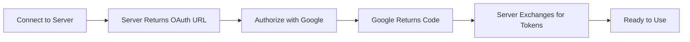

# OAuth-Only Setup for YouTube Music MCP Server

## Overview

This server uses **OAuth 2.0 exclusively** for authentication with YouTube Music. No manual token management or header copying required.

## For Server Owners (You)

### Prerequisites

You need to set these environment variables in Smithery:

1. `GOOGLE_CLIENT_ID` - Your Google OAuth 2.0 client ID
2. `GOOGLE_CLIENT_SECRET` - Your Google OAuth 2.0 client secret

### Setting Environment Variables in Smithery

1. Go to your Smithery deployment settings
2. Add environment variables:
   - Key: `GOOGLE_CLIENT_ID`
   - Value: Your client ID (e.g., `975146857853-xxxxx.apps.googleusercontent.com`)
   
   - Key: `GOOGLE_CLIENT_SECRET`  
   - Value: Your client secret (e.g., `GOCSPX-xxxxxxxxxxxxx`)

3. Save and deploy

## For End Users

### How It Works

1. **Install the server** from Smithery
2. **First connection** - You'll be redirected to Google OAuth
3. **Authorize** - Sign in with your Google account that has YouTube Music
4. **Automatic setup** - Tokens are managed automatically
5. **Use tools** - All YouTube Music features are available

### The OAuth Flow



### No Configuration Required

- ✅ No manual token copying
- ✅ No header extraction
- ✅ No configuration fields
- ✅ Automatic token refresh
- ✅ Secure authentication

## OAuth Endpoints

The server exposes these OAuth endpoints:

- `GET /oauth/authorize` - Starts OAuth flow, returns Google auth URL
- `POST /oauth/token` - Exchanges authorization code for tokens
- `POST /oauth/refresh` - Refreshes expired access tokens

## MCP Integration

When a client connects without authentication:

1. Server returns 401 with `WWW-Authenticate` header
2. Client detects OAuth requirement
3. Client calls `/oauth/authorize` to get auth URL
4. User authorizes in browser
5. Client exchanges code at `/oauth/token`
6. Client includes Bearer token in all requests

## Security

- OAuth credentials stored as environment variables
- PKCE flow for enhanced security
- Tokens never exposed to end users
- Automatic token refresh
- Session isolation between users

## Testing the OAuth Flow

```bash
# 1. Test authorization endpoint
curl http://localhost:8081/oauth/authorize?redirect_uri=http://localhost:3000/callback

# Returns:
{
  "auth_url": "https://accounts.google.com/o/oauth2/v2/auth?...",
  "state": "random_state_token"
}

# 2. User authorizes and gets code
# 3. Exchange code for tokens
curl -X POST http://localhost:8081/oauth/token \
  -H "Content-Type: application/json" \
  -d '{"code": "auth_code", "state": "state_token"}'

# Returns:
{
  "access_token": "ya29...",
  "token_type": "Bearer",
  "expires_in": 3600,
  "refresh_token": "1//..."
}

# 4. Use with Bearer token
curl -X POST http://localhost:8081/ \
  -H "Authorization: Bearer ya29..." \
  -H "Content-Type: application/json" \
  -d '{"method": "tools/list"}'
```

## Deployment File

Use `smithery.yaml` with OAuth configuration:

```yaml
runtime: "container"
build:
  dockerfile: "Dockerfile"
  dockerBuildPath: "."
startCommand:
  type: "http"
  authentication:
    type: "oauth2"
    authorizationEndpoint: "/oauth/authorize"
    tokenEndpoint: "/oauth/token"
    refreshEndpoint: "/oauth/refresh"
    scopes: ["youtube"]
```

## Benefits

1. **Zero Configuration** - Users don't configure anything
2. **Automatic Setup** - OAuth flow on first use
3. **Token Management** - Handled by MCP protocol
4. **Security** - OAuth 2.0 with PKCE
5. **User Experience** - One-click authorization

## Troubleshooting

### "OAuth credentials not configured"
- Verify GOOGLE_CLIENT_ID and GOOGLE_CLIENT_SECRET are set in Smithery
- Check environment variable names are exact

### "401 Unauthorized"
- Normal on first connection - triggers OAuth flow
- If persists, user needs to re-authorize

### "Invalid client"
- Verify OAuth credentials are correct
- Check YouTube Data API is enabled in Google Cloud Console

## Summary

This implementation provides a seamless OAuth experience where:
- **Server owners** set OAuth credentials once in environment variables
- **End users** authorize once with Google
- **Everything else** is automatic

No manual configuration, no token management, just OAuth!