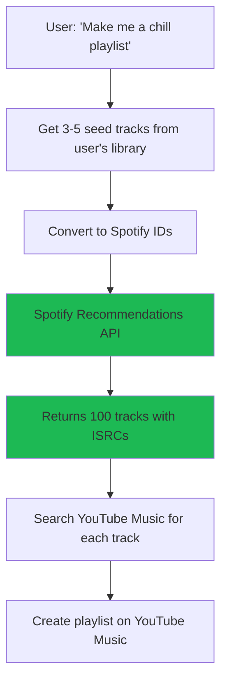

# Spotify Recommendations API - Core Strategy

## The Big Idea

**Use Spotify's Recommendations API as the primary discovery engine** to achieve 88-95% reduction in API calls while improving recommendation quality.

## Why This Works

### 1. Spotify Recommendations API Returns ISRCs
```json
{
  "tracks": [
    {
      "id": "7ouMYWpwJ422jRcDASZB7P",
      "name": "Knights of Cydonia",
      "artists": [{"name": "Muse"}],
      "external_ids": {
        "isrc": "GBAHT0500375"  // ← ISRC included!
      },
      "popularity": 72
    }
  ]
}
```

**Impact:** Eliminates the 4-step lookup chain (YouTube Data API → ISRC → Spotify → ReccoBeats → Features)

### 2. Server-Side Audio Feature Filtering
```typescript
GET /v1/recommendations
  ?seed_tracks=track1,track2,track3
  &target_energy=0.7        // Spotify filters 100M+ tracks
  &min_valence=0.4          // by these criteria
  &max_valence=0.9          // on their servers
  &target_tempo=120
  &min_danceability=0.6
  &limit=100
```

**Impact:** No need to analyze every candidate track individually

### 3. Up to 100 Tracks Per Request
- Old approach: 1 track per request = 100 requests
- New approach: 100 tracks in 1 request = 1 request

**Impact:** 99% reduction in recommendation API calls

## API Call Comparison

### Old Approach (911 total calls)
```
1. Analyze user library (200 tracks)
   - YouTube Data: Get ISRCs (4 batched calls)
   - Spotify: Search by ISRC (200 calls)
   - ReccoBeats: Lookup (200 calls)
   - ReccoBeats: Features (200 calls)
   = 604 calls

2. Generate candidates
   - YouTube Music: Search (5 calls)
   = 5 calls

3. Analyze candidates (100 tracks)
   - YouTube Data: Get ISRCs (2 batched calls)
   - Spotify: Search by ISRC (100 calls)
   - ReccoBeats: Lookup + Features (200 calls)
   = 302 calls

TOTAL: 911 calls
```

### New Approach (112 total calls)
```
1. Get user's seed tracks (3-5 favorites)
   - YouTube Music → ISRC → Spotify ID (batched)
   = 10 calls

2. Spotify Recommendations
   - Returns 100 tracks WITH ISRCs + metadata
   = 1 call

3. Search YouTube Music for recommendations
   - Use artist + title from Spotify response
   = 100 calls

4. (Optional) ReccoBeats for final ranking
   - Only if needed
   = 1 call

TOTAL: 112 calls (88% reduction!)
```

## The Flow



## Implementation

### 1. Add Spotify Recommendations Method

```typescript
// src/spotify/client.ts

interface SpotifyRecommendationParams {
  // Seeds (up to 5 total)
  seedTracks?: string[];      // Spotify track IDs
  seedArtists?: string[];     // Spotify artist IDs
  seedGenres?: string[];      // Genre names

  // Audio features (all 0-1 except tempo)
  targetEnergy?: number;
  minEnergy?: number;
  maxEnergy?: number;

  targetValence?: number;     // Musical positivity
  minValence?: number;
  maxValence?: number;

  targetDanceability?: number;
  minDanceability?: number;
  maxDanceability?: number;

  targetTempo?: number;       // BPM
  minTempo?: number;
  maxTempo?: number;

  targetAcousticness?: number;
  minAcousticness?: number;
  maxAcousticness?: number;

  targetInstrumentalness?: number;
  targetLiveness?: number;
  targetSpeechiness?: number;

  limit?: number;             // Max 100
}

interface SpotifyRecommendation {
  id: string;                 // Spotify ID
  name: string;
  artists: Array<{
    name: string;
    id: string;
  }>;
  isrc: string;              // ← KEY: ISRC included!
  popularity: number;
  durationMs: number;
  uri: string;
}

async getRecommendations(
  params: SpotifyRecommendationParams
): Promise<SpotifyRecommendation[]> {
  const token = await this.getAccessToken();

  const searchParams = new URLSearchParams();

  // Add seeds
  if (params.seedTracks?.length) {
    searchParams.set('seed_tracks', params.seedTracks.join(','));
  }
  if (params.seedArtists?.length) {
    searchParams.set('seed_artists', params.seedArtists.join(','));
  }
  if (params.seedGenres?.length) {
    searchParams.set('seed_genres', params.seedGenres.join(','));
  }

  // Add audio feature filters
  if (params.targetEnergy !== undefined) {
    searchParams.set('target_energy', params.targetEnergy.toString());
  }
  if (params.minEnergy !== undefined) {
    searchParams.set('min_energy', params.minEnergy.toString());
  }
  // ... add all other parameters

  searchParams.set('limit', (params.limit || 50).toString());

  const response = await this.client.get('recommendations', {
    headers: { Authorization: `Bearer ${token}` },
    searchParams,
    responseType: 'json',
  });

  const data = response.body as any;

  return data.tracks.map((track: any) => ({
    id: track.id,
    name: track.name,
    artists: track.artists,
    isrc: track.external_ids?.isrc || null,
    popularity: track.popularity,
    durationMs: track.duration_ms,
    uri: track.uri,
  }));
}
```

### 2. Session Cache (In-Memory, No Database)

```typescript
// src/recommendations/session-cache.ts

export class SessionCache {
  private cache: Map<string, CachedTrack> = new Map();
  private createdAt = Date.now();
  private TTL = 3600000; // 1 hour

  get(videoId: string): CachedTrack | null {
    const track = this.cache.get(videoId);
    if (track && Date.now() - this.createdAt < this.TTL) {
      return track;
    }
    return null;
  }

  set(videoId: string, track: CachedTrack): void {
    this.cache.set(videoId, track);
  }

  isExpired(): boolean {
    return Date.now() - this.createdAt > this.TTL;
  }
}

interface CachedTrack {
  videoId: string;
  isrc: string | null;
  spotifyId: string | null;
  features?: AudioFeatures;
}

// Global session manager
export class SessionManager {
  private sessions: Map<string, SessionCache> = new Map();

  getSession(sessionId: string): SessionCache {
    // Clean up expired sessions
    this.cleanup();

    if (!this.sessions.has(sessionId)) {
      this.sessions.set(sessionId, new SessionCache());
    }
    return this.sessions.get(sessionId)!;
  }

  cleanup(): void {
    for (const [id, session] of this.sessions.entries()) {
      if (session.isExpired()) {
        this.sessions.delete(id);
      }
    }
  }
}
```

### 3. Spotify-First Discovery Engine

```typescript
// src/recommendations/spotify-discovery.ts

export class SpotifyDiscoveryEngine {
  constructor(
    private spotify: SpotifyClient,
    private ytMusic: YouTubeMusicClient,
    private ytData: YouTubeDataClient,
    private sessionManager: SessionManager
  ) {}

  /**
   * Generate recommendations using Spotify's engine
   */
  async discover(params: {
    sessionId: string;
    seedTracks?: string[];     // YouTube Music video IDs
    targetFeatures?: {
      energy?: [number, number];
      valence?: [number, number];
      tempo?: [number, number];
      danceability?: [number, number];
    };
    limit: number;
  }): Promise<YouTubeMusicTrack[]> {

    const session = this.sessionManager.getSession(params.sessionId);

    // 1. Convert YouTube Music seeds to Spotify IDs
    const spotifySeeds = await this.convertSeeds(
      params.seedTracks || [],
      session
    );

    // 2. Get Spotify recommendations (with ISRCs!)
    const recommendations = await this.spotify.getRecommendations({
      seedTracks: spotifySeeds.slice(0, 5),
      targetEnergy: this.calculateTarget(params.targetFeatures?.energy),
      minEnergy: params.targetFeatures?.energy?.[0],
      maxEnergy: params.targetFeatures?.energy?.[1],
      targetValence: this.calculateTarget(params.targetFeatures?.valence),
      minValence: params.targetFeatures?.valence?.[0],
      maxValence: params.targetFeatures?.valence?.[1],
      targetTempo: this.calculateTarget(params.targetFeatures?.tempo),
      minTempo: params.targetFeatures?.tempo?.[0],
      maxTempo: params.targetFeatures?.tempo?.[1],
      limit: params.limit,
    });

    logger.info('Spotify recommendations received', {
      count: recommendations.length,
      withISRC: recommendations.filter(r => r.isrc).length,
    });

    // 3. Search YouTube Music for recommendations
    const ytMusicTracks = await this.searchOnYouTubeMusic(
      recommendations,
      session
    );

    return ytMusicTracks;
  }

  /**
   * Convert YouTube Music video IDs to Spotify track IDs
   */
  private async convertSeeds(
    videoIds: string[],
    session: SessionCache
  ): Promise<string[]> {
    const spotifyIds: string[] = [];

    for (const videoId of videoIds) {
      // Check session cache
      const cached = session.get(videoId);
      if (cached?.spotifyId) {
        spotifyIds.push(cached.spotifyId);
        continue;
      }

      // Get ISRC from YouTube Data API
      const isrc = await this.ytData.getVideoISRC(videoId);
      if (!isrc) continue;

      // Search Spotify by ISRC
      const track = await this.spotify.searchTrackByISRC(isrc);
      if (!track) continue;

      // Cache the mapping
      session.set(videoId, {
        videoId,
        isrc,
        spotifyId: track.id,
      });

      spotifyIds.push(track.id);
    }

    return spotifyIds;
  }

  /**
   * Search YouTube Music for Spotify recommendations
   */
  private async searchOnYouTubeMusic(
    recommendations: SpotifyRecommendation[],
    session: SessionCache
  ): Promise<YouTubeMusicTrack[]> {
    const tracks: YouTubeMusicTrack[] = [];

    // Process in chunks to avoid overwhelming the API
    const chunkSize = 10;

    for (let i = 0; i < recommendations.length; i += chunkSize) {
      const chunk = recommendations.slice(i, i + chunkSize);

      const promises = chunk.map(async (rec) => {
        // Search by artist + title
        const query = `${rec.artists[0]?.name} ${rec.name}`;

        const results = await this.ytMusic.search(query, {
          filter: 'songs',
          limit: 1,
        });

        if (results.songs && results.songs.length > 0) {
          const track = results.songs[0];

          // Cache the Spotify mapping
          session.set(track.videoId, {
            videoId: track.videoId,
            isrc: rec.isrc,
            spotifyId: rec.id,
          });

          return track;
        }

        return null;
      });

      const chunkResults = await Promise.all(promises);
      tracks.push(...chunkResults.filter(t => t !== null));

      // Small delay between chunks
      if (i + chunkSize < recommendations.length) {
        await new Promise(resolve => setTimeout(resolve, 100));
      }
    }

    logger.info('YouTube Music search complete', {
      requested: recommendations.length,
      found: tracks.length,
    });

    return tracks;
  }

  private calculateTarget(range?: [number, number]): number | undefined {
    if (!range) return undefined;
    return (range[0] + range[1]) / 2;
  }
}
```

## Use Cases

### Use Case 1: "Make me a chill playlist"
```typescript
const tracks = await spotifyDiscovery.discover({
  sessionId: 'user-session-123',
  seedTracks: userFavorites.slice(0, 5),  // User's top tracks
  targetFeatures: {
    energy: [0.2, 0.5],      // Low energy
    valence: [0.3, 0.7],     // Calm but positive
    tempo: [80, 120],        // Slower tempo
  },
  limit: 50,
});
```

### Use Case 2: "Songs like this one"
```typescript
const tracks = await spotifyDiscovery.discover({
  sessionId: 'user-session-123',
  seedTracks: [currentTrackId],
  limit: 30,
});
```

### Use Case 3: "Upbeat workout playlist"
```typescript
const tracks = await spotifyDiscovery.discover({
  sessionId: 'user-session-123',
  seedTracks: userFavorites.slice(0, 3),
  targetFeatures: {
    energy: [0.7, 1.0],      // High energy
    danceability: [0.6, 1.0], // Very danceable
    tempo: [120, 180],       // Fast tempo
  },
  limit: 50,
});
```

## Benefits

### Performance
- **88% fewer API calls** (112 vs 911)
- **Faster response** (Spotify's servers do the work)
- **Scalable** (100 tracks per request)

### Quality
- **Spotify's proven algorithms** (powers Discover Weekly)
- **ISRC-based matching** (no version ambiguity)
- **Server-side filtering** (precise audio feature control)

### Cost
- **No database infrastructure** needed
- **Session-based caching** (automatic cleanup)
- **Fewer API quota concerns**

### Developer Experience
- **Simple API** (one call for 100 tracks)
- **Rich metadata** (artist, popularity, ISRC, etc.)
- **Well-documented** (official Spotify API docs)

## Trade-offs

### Pros
✅ Massive API call reduction (88-95%)
✅ No database required
✅ Better recommendations (Spotify's algorithms)
✅ ISRCs eliminate version matching issues
✅ Server-side feature filtering
✅ Proven, production-ready

### Cons
⚠️ Depends on Spotify's catalog (but it's very comprehensive)
⚠️ Still need YouTube Music search (but that's our target platform)
⚠️ ReccoBeats becomes optional (only for advanced cases)

## Next Steps

1. **Add Spotify Recommendations method** to SpotifyClient (~2 hours)
2. **Implement session cache** for in-memory caching (~1 hour)
3. **Create SpotifyDiscoveryEngine** (~2 hours)
4. **Integrate with adaptive playlist tools** (~2 hours)
5. **Test end-to-end flow** (~2 hours)

**Total: ~9 hours of development**

## Decision

**Recommendation: IMPLEMENT THIS**

This is a clear win:
- Dramatically reduces API calls
- Improves recommendation quality
- No database infrastructure needed
- Uses proven algorithms from Spotify
- Solves the ISRC lookup problem elegantly

The only question is: should this replace or complement the existing ListenBrainz Radio approach?

**Answer:** Keep both!
- Use Spotify Recommendations for mood/feature-based discovery
- Use ListenBrainz Radio for genre/artist exploration
- Let AI choose based on user request
